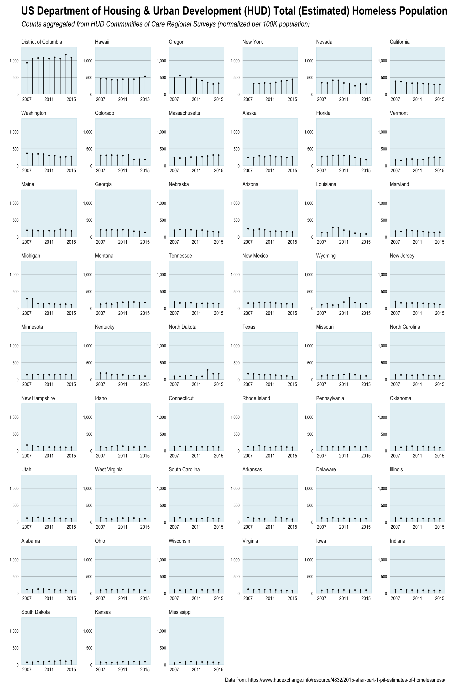

## 52Vis Week 2 (2016-14)

### Why 52Vis?

In case folks are wondering why I'm doing this, it's pretty simple. We need a society that has high data literacy and we need folks who are capable of making awesome, truthful data visualizations. The only way to do that is by working with data over, and over, and over, and over again. 

Directed projects with some reward are one of the best Pavlovian ways to accomplish that :-)

### This week's challenge

The Data is Plural folks have [done it again](http://tinyletter.com/data-is-plural/letters/data-is-plural-2016-04-06-edition) and there's a neat and important data set in this week's vis challenge.

From their newsletter:

>_Every January, at the behest of the U.S. Department of Housing and Urban Development, volunteers across the country attempt to count the homeless in their communities. The result: HUD’s “point in time” estimates, which are currently available for 2007–2015. The most recent estimates found 564,708 homeless people nationwide, with 75,323 of that count (more than 13%) living in New York City._

I decided to take a look at this data by seeing which states had the worst homeless problem per-capita (i.e. per 100K population). I've included the population data along with some ready-made wrangling of the HUD data.

But, before we do that&hellip;

### RULES UPDATE + Last week's winner

I'll be announcing the winner on Thursday since I:

- am horribly sick after being exposed to who knows what after rOpenSci last week in SFO :-)
- have been traveling like mad this week
- need to wrangle all the answers into the github repo and get @laneharrison (and his students) to validate my choice for winner (I have picked a winner)

Given how hard the wrangling has been, I'm going to need to request that folks both leave a blog comment and file a PR to [the github repo](https://github.com/52vis/2016-14) for this week. Please include the code you used as well as the vis (or a link to a working interactive vis)

### PRIZES UPDATE

Not only can I offer [Data-Driven Security](http://dds.ec/amzn), but Hadley Wickham has offered signed copies of his books as well, and I'll keep in the Amazon gift card as a catch-all if you have more (NOTE: if any other authors want to offer up their tomes shoot me a note!).

### No place to roam

Be warned: this was a pretty depressing data set. I went in with the question of wanting to know which "states" had the worst problem and I assumed it'd be California or New York. I had no idea it would be what it was and the exercise shattered some assumptions.

The code is in [`homeless.r`](homeless.r) and I've included U.S. population data for the necessary time period.

Remember, this is language/tool agnostic & go in with a good question or two, augment as you feel you need to and show us your vis!

Week 2's content closes 2016-04-12 23:59 EDT
