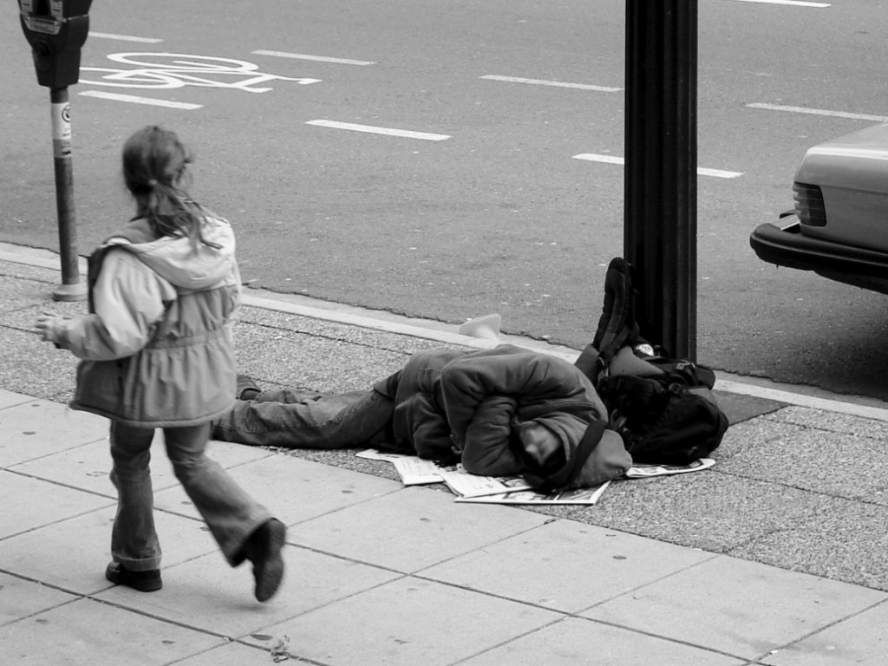

<link rel="stylesheet" href="styles.css">
<script src="custom.js"></script>
<div id="bg"></img></div>
```{r setup, include = FALSE, echo = FALSE, meesage = FALSE, warning = FALSE}
knitr::opts_chunk$set(echo = FALSE, meesage = FALSE, warning = FALSE)
rm(list = ls())
library("dplyr")
library("viridisLite")
library("highcharter")
library("scales")
library("forecast")
source("data.R")
data("usgeojson")


maincolor <- "#2c3e50"
defaultcolor <- hex_to_rgba("#3f3f3f", 0.25)
H <- 400

thm <- hc_theme(
  backgroundColor = "transparent",
  colors = c(maincolor, hc_theme_flat()$colors)
)
```

## {.tabset .tabset-fade .tabset-pills}

### are they?

```{r}
dft <- df %>% 
  filter(year == max(year)) %>% 
  select(-year, -total_homeless_per_100k, -state) %>% 
  arrange(desc(n)) %>% 
  mutate(p = 100*n/sum(n),
         seq = row_number())

ng <- 4

dft1 <- dft %>% 
  filter(seq <= ng) 

dft2 <- dft %>% 
  filter(seq >= ng + 1) %>% 
  summarise(n = sum(n), p = sum(p)) %>% 
  mutate(population = sum(dft$population) - sum(dft1$population),
         p =  sum(dft$p) - sum(dft1$p),
         name = "Rest of states")

dft <- bind_rows(dft1, dft2) %>% 
  select(-seq) %>% 
  mutate(pr = round(p))
```

<div class="col-md-4">
A lot of people are homeless in the U.S. In fact, in 2015
they were `r comma(sum(dft$n))` and the `r  dft$pr[1]`%
(`r comma(dft$n[1])`) of them were lived in **California**. By counts California is
followed by **New York**, **Florida** and **Texas** doing almost
the 50% of all homeless people in U.S.

The next chart is a representation of the distribution of the 
homeless people. Each icon represent  ~`r  round(sum(dft$n)/100)`
peolpe.

</div>

<div class="col-md-8">
```{r}
w <- 20
h <- 5

dcoords <- data_frame(x =  rep(1:w, h),
                 y = rep(1:h, each = w)) %>% 
  mutate(gr = rep(seq(nrow(dft)), times = dft$pr)) %>% 
  group_by(gr) %>% 
  do(data = list.parse2(data_frame(.$x, .$y)))

dst <- list.parse2(bind_cols(dft, dcoords)) %>% 
  map(function(x){
    x$marker = list(symbol = fa_icon_mark("male"), radius = 7)
    x$icon = fa_icon("male")
    x
  })

hcw <- highchart(height = H) %>% 
  hc_chart(type = "scatter") %>% 
  hc_yAxis(reversed = TRUE) %>% 
  hc_tooltip(enabled = FALSE) %>% 
  hc_plotOptions(
    series = list(
       animation = list(duration = 3*1000),
       states = list(
         hover = list(
           enabled = FALSE
         )
       )
    )
  ) %>% 
  hc_add_theme(
    hc_theme_merge(thm, hc_theme_null())
  ) 

hcw$x$hc_opts$series <- dst

hcw

```
</div>

### were they?

```{r}
dcd <- df %>% 
  filter(state == "DC", year == max(year))

```

<div class="col-md-4">
However the previous chart don't consider the population size of each
state hidding **crucial information**.

In fact, the previous years the **Distric of Columnbia** has been the state
with the greatest rate of homelessness people by far followed by 
**Hawaii** and **New York**. 

</div>

<div class="col-md-8">
```{r}
fmtrr <- "function() {
  if (this.point.x == this.series.data[this.series.data.length-1].x) {
      return this.series.options.id;
  } else {
      return null;
  }
}"

dtlopts <- list(
        enabled = TRUE,
        align = "left",
        verticalAlign = "middle",
        formatter = JS(fmtrr),
        crop = FALSE,
        overflow = FALSE
      )

dss <- df %>% 
  arrange(name, year) %>% 
  group_by(name) %>% 
  do(dss = list(
    name = first(.$name),
    id = first(.$state),
    data = .$total_homeless_per_100k,
    color = ifelse(first(.$name) == "District of Columbia", maincolor, defaultcolor)
  )) %>% 
  .$dss

hc_tms <- highchart(height = H) %>%
  hc_chart(type = "spline", backgroundColor = "transparent") %>%
  hc_plotOptions(
    series = list(
      animation = list(duration = 3*1000),
      dataLabels = dtlopts,
      showInLegend = FALSE,
      animation = list(duration = 5*1000),
      marker = list(enabled = FALSE),
      events = list(
        mouseOver = JS(sprintf("function(){ this.update({color: '%s'})}", maincolor)),
        mouseOut = JS(sprintf("function(){ this.update({color: '%s'}) }", defaultcolor))
      )
      )
    ) %>% 
  hc_tooltip(valueDecimals = 0) %>% 
  hc_yAxis(title = list(text = "Homeless people by 100k habitants")) %>% 
  hc_xAxis(categories = sort(unique(homeless$year)),
           tickmarkPlacement = "on")

hc_tms$x$hc_opts$series <- dss
hc_tms
```
</div>

### they will be?

```{r hope}
df <- df %>% 
  arrange(state, year) 
df <- df %>% mutate(n = ifelse(is.na(n) & state == "NY", 61125, n))
df$n[is.na(df$n)] <- (df$n[which(is.na(df$n)) + 1] + df$n[which(is.na(df$n)) - 1] ) /2

dftot <- df %>% 
  group_by(year) %>% 
  summarise(n = sum(n, na.omit = TRUE),
            p = sum(population)) %>% 
  ungroup() %>% 
  mutate(hml_per_100k = n/p*100000)

tmsr <- ts(dftot$n, start = 2007)

hc <- hchart(splinef(tmsr, level = 95, h = 5)) %>% 
  hc_yAxis(min = 0) %>% 
  hc_chart(
    backgroundColor = "transparent"
  ) %>% 
  hc_xAxis(tickmarkPlacement = "on") %>% 
  hc_tooltip(valueDecimals = 0) %>% 
  hc_yAxis(title = list(text = "Homeless people")) %>% 
  hc_plotOptions(
    series = list(
      animation = list(duration = 3*1000)
    )
  )
  

p <- diff(dftot$hml_per_100k)/dftot$hml_per_100k[8]
p <- percent(abs(mean(p))) 
```


<div class="col-md-4">
There is **hope**.

Every year, the number is reduced approximately by `r p` and these numbers
try to convince us there will be less poeople without home... But is not 
about numbers, is **about us** to change this reality making
better choices, making a better world to live.
</div>
<div class="col-md-8">
```{r}
hc$height <- H
hc$x$hc_opts$series[[1]]$color <- maincolor
hc$x$hc_opts$series[[1]]$name <- "Homelessness"
hc$x$hc_opts$series[[2]]$name <- "Predicted trend"
hc$x$hc_opts$series[[2]]$color <- "red"

hc
```
</div>


