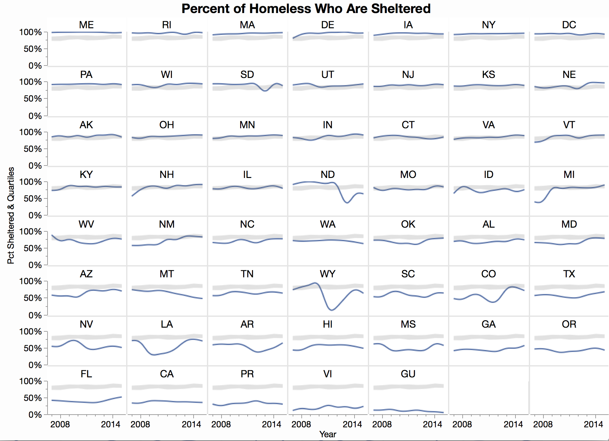
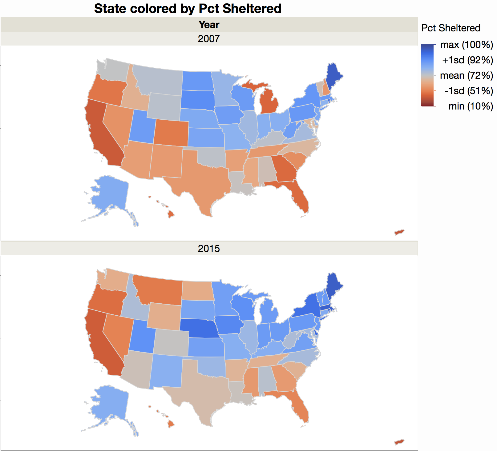

# Visualization of homelessness data for #52Vis #2

Of all the data in the homelessness data set, I thought it would be interesting to look at the percentage of the homeless who were "sheltered" versus the whole population. This might show climate issues or policy issues. I looked at data at the state level.

These graphs were created interactively in [JMP](http://jmp.com). The first looks at state sheltered rates over time. I used state as a grouping variable and showed the data with a spline smoother to capture the trends. The gray region shows the national range of lower to upper quartiles.

It's interesting to see some abrupt changes, so in Wyoming and North Dakota, presumably due to the oil busts. Michigan has been improving, or maybe they just had their bust before this data started.

Guessing climate plays a big part in the percent of unsheltered homeless, I showed the state rates on a map. Since these is some time variation, I show two years for comparison. The coloring is centered on the mean, about 72% sheltered.

Not shown in the map, Guam and US Virgin Islands have very low sheltered percentages. The map uses an Albers projection and it's a lttle wide to include Puerto Rico.

