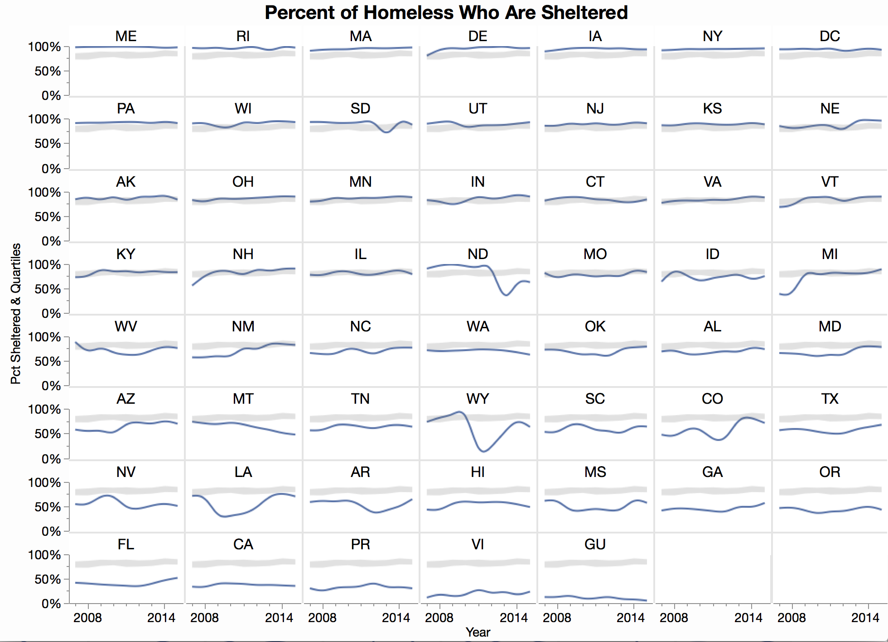
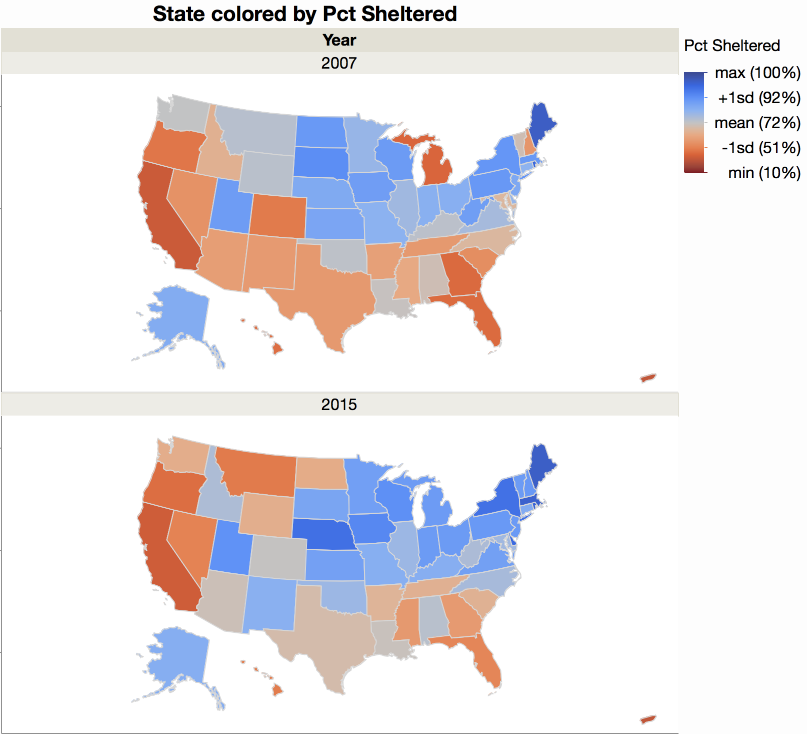

# Visualization of homelessness data for #52Vis #2

Of all the data in the homelessness data set, I thought it would be interesting to look at the percentage of the homeless who were "sheltered" versus the whole homeless population. This might show climate, political or economical factors. I looked at data at the state level.

These graphs were created interactively in [JMP](http://jmp.com)'s Graph Builder. The first looks at state sheltered rates over time. I used state as a grouping variable to get a small multiples effect and showed the data with a spline smoother to capture the trends. The gray region shows the national range of lower to upper quartiles and was made with the range mode of the area element. It serves as a anchor reference since the data is so far away from the shared axes. I used computed columns for the quartiles.

It's interesting to see some abrupt changes, as in Wyoming and North Dakota, presumably due to the oil busts. Michigan has been improving, or maybe they just had their bust before this data started.

Guessing climate plays a big part in the percent of unsheltered homeless, I plotted the state rates on a map. Since there is some time variation, I show two years for comparison. I used a diverging scale centered on the mean, which is about 72% sheltered, to emphasize deviation from the national average.

Not shown in the map, Guam and US Virgin Islands have very low sheltered percentages. The map uses an Albers projection, andI made it a lttle wide to include Puerto Rico.

